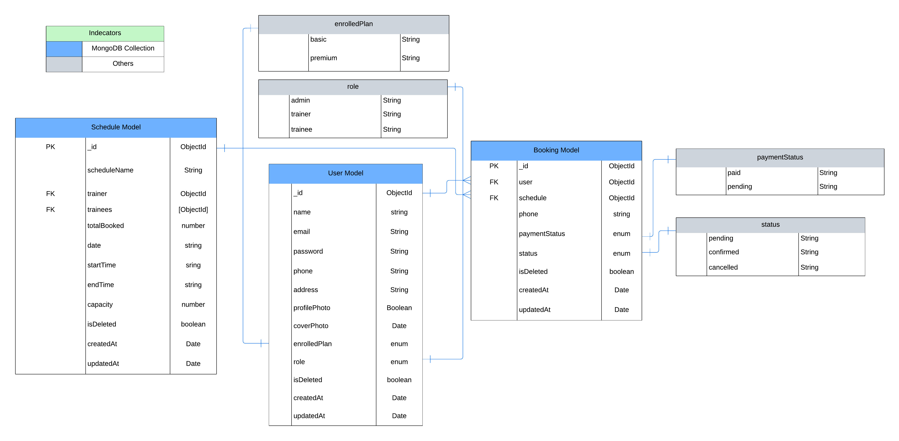

# Gym Class Management

The Gym Class Scheduling and Membership Management System is designed to manage gym operations efficiently. The system defines three roles: Admin, Trainer, and Trainee, each with specific permissions. Admins are responsible for creating and managing trainers, scheduling classes, and assigning trainers to these schedules. Each day can have a maximum of five class schedules, with each class lasting two hours. Trainers conduct the classes and can view their assigned class schedules but cannot create new schedules or manage trainee profiles. Trainees can create and manage their own profiles and book class schedules if there is availability, with a maximum of ten trainees per schedule.

The system enforces several business rules to ensure smooth operations. Admins are limited to scheduling a maximum of 5 classes per day, and each schedule can accommodate no more than 10 trainees. If a class schedule reaches its capacity, trainees will be prevented from making further bookings, and admins cannot create additional schedules beyond the daily limit. JWT-based authentication is implemented to control access, ensuring that only authorized users can perform specific actions, such as booking classes or managing trainers. Robust error handling is integrated throughout the system, addressing issues such as unauthorized access, validation errors, and booking limit violations. This system provides an organized and flexible solution for managing gym class scheduling and membership, with well-defined roles and responsibilities.

**Three models are**

1. User Model
2. Schedule Model
3. Booking Model

#### **Technology Stack**

- Programming Language: Typescript
- Web Framework: Express.js
- ORM or ODM: Mongoose
- Database: MongoDB
- Authentication: JWT (JSON Web Tokens)
- Password encryption: bcrypt
- cors
- Zod etc

#### **Entity Relationship Diagram Diagram**


Description: This is an updated diagram illustrates the relationships among User, Schedule, and Bookings.

Here is the lucid chard link of model diagram [link](https://lucid.app/lucidchart/92b6f7c7-0652-4baa-811c-9be3fc129533/edit?viewport_loc=-157%2C-446%2C2488%2C1142%2C0_0&invitationId=inv_06581349-aabb-40be-8a4b-3f362d16d7a0)

---

### Business Logics:

**1. User Management:**

- Anyone can signup as a new user and login with email and password
- By default every user's role is trainee and admin can promote a trainee to a trainer or admin.
- Multiple user cannot use one email for different account.
- Every user can update his information including profile photo, cover photo and others.
- An admin can delete user or update user enrolled plan and others info.

**2. Class Scheduling:**

- Each day is limited to a maximum of 5 class schedules.
- Each class schedule lasts for 2 hours. Schedule start time cannot be less than end time.
- The system enforces a maximum of 10 trainees per class schedule. Once the limit is reached, no additional bookings can be made for that schedule.
- Admins are responsible for scheduling classes and assigning trainers.
- Admin cannot assign multiple schedule to a trainer at same date and same time. Only if the trainer is free at that selected time then admin can assign him a schedule.
- Trainer can see the schedules which are assigned to him. And every authenticated user can see all the available schedules

**3. Booking System:**

- Trainees can book class schedules if the schedule has available slots (maximum of 10 trainees per schedule).
- A trainee cannot book multiple classes in the same time or slot.
- Trainees can cancel their bookings if needed.
- Trainees can see his won booked schedules

---

- **Basic structure of successful response:**

```

 TMeta = {
  page: number;
  limit: number;
  total: number;
  totalPage: number;
};

TResponse<T> = {
  statusCode: number;
  success: boolean;
  message?: string;
  token?: string;
  meta?: TMeta;
  data: T;
}

*token will apply only auth request and meta will apply only get request*
```

- **Basic structure of error response:**

```
TResponse<T> = {
   success: false,
    message: string,
    errorDetails:  [
        {
            field: string,
            message: string
        }
    ],
    err: errorObject,
    stack: string | null,
}

*stack will apply only development server*
```

- **Validation Error sample**

```
{
    "success": false,
    "message": "Validation Error",
    "errorDetails": [
        {
            "message": "Start time should be before End time !  "
        }
    ],
    "err": {
        "issues": [
            {
                "code": "custom",
                "message": "Start time should be before End time !  ",
                "path": []
            }
        ],
        "name": "ZodError"
    },
    "stack": null
}
```

- **UnAuthorized Error sample**

```
{
    "success": false,
    "message": "You are not authorized for this request",
    "errorDetails": [
        {
            "field": "",
            "message": "You are not authorized for this request"
        }
    ],
    "err": {
        "statusCode": 401,
        "success": false
    },
    "stack": null
}
```

- **Limit exceeded Error sample**

```
{
    "success": false,
    "message": "There is no free slots in that Schedule.",
    "errorDetails": [
        {
            "field": "",
            "message": "There is no free slots in that Schedule."
        }
    ],
    "err": {
        "statusCode": 404,
        "success": false
    },
    "stack": null
}
```

- **Successful booking response sample**

```
{
    "success": true,
    "statusCode": 201,
    "message": "Booking created successfully",
    "data": {
        "user": "67b33db8680cbb1514982713",
        "schedule": "67b3852450465f9e74a2992f",
        "phone": "+1234567890",
        "status": "pending",
        "paymentStatus": "paid",
        "isDeleted": false,
        "_id": "67b3856d50465f9e74a2993a",
        "createdAt": "2025-02-17T18:52:29.590Z",
        "updatedAt": "2025-02-17T18:52:29.590Z",
    }
}
```

- **Route not found response:**

```
 {
    "success": false,
    "message": "API not Found !!",
    "errorDetails": ""
}
```

## Database Model Schemas

- **User Model:**

```
 {
    name: { type: String, required: true },
    email: { type: String, required: true, unique: true},
    password: { type: String, required: true, select: 0},
    phone: { type: String, required: true},

    profilePhoto: { type: String, default: "https://res.cloudinary.com/dbwftcxvx/image/upload/v1727985302/image_8_sdrdqj.jpg"},

    coverPhoto: { type: String, default: "https://res.cloudinary.com/dbwftcxvx/image/upload/v1735279938/Brown_Modern_Hotel_Promo_Instagram_Post_1200_x_330_px_p1e49r.png"},

    address: { type: String, required: true, },
    role: {type: String, default: "trainee", enum: ["trainer", "trainee", "admin"]},
    enrolledPlan: {type: String, required: true, enum: ["basic", "premium"]},
    isDeleted: {      type: Boolean,      default: false,    },
  },
  {
    timestamps: true,
  }

```

- **Schedule Model:**

```
 {
    scheduleName: { type: String, required: true, maxlength: 100 },
    trainer: { type: Schema.Types.ObjectId, ref: "User", required: true },
    trainees: [{ type: Schema.Types.ObjectId, ref: "User", default: [] }],
    totalBooked: { type: Number, min: 0, max: 10, default: 0 },
    date: { type: String, required: true },
    startTime: { type: String, required: true },
    endTime: { type: String, required: true },
    capacity: { type: Number, required: true, min: 1, max: 10 },
    isDeleted: { type: Boolean, default: false },
  },
  { timestamps: true }

```

- **Booking Model:**

```
 {
    user: { type: Schema.Types.ObjectId, ref: "User", required: true },
    schedule: { type: Schema.Types.ObjectId, ref: "Schedule", required: true },
    phone: { type: String, required: true },
    status: {  type: String, enum: ["pending", "confirmed", "cancelled"], default: "pending" },
    paymentStatus: { type: String, enum: ["paid", "pending", "cancelled"], default: "pending" },
    isDeleted: { type: Boolean, default: false },
  },
  { timestamps: true }

```

---

## Testing guideline:

### **Use Authorization with bearer for every authenticated request**

---

> [!NOTE]
>
> **An Admin credential.**
>
> ```language
> Email: admin@gym.com
> Password: admin1234
> ```

> ## _API end points Overview_
>
> ### User
>
> - POST: api/auth/signup
> - POST: api/auth/login
> - PATCH: api/auth/update-user/:userId
> - DELETE: api/auth/users/:userId
> - GET: api/auth/users/:userId
> - GET: api/auth/users(Only Accessible by Admin)
>   <br/> ** For get all user you can use params like search, sort, filter, fields and paginate like this**
> - GET: api/auth/users?search="dhaka"&fields=email(Only Accessible by Admin)

> ### Schedule
>
> - POST: api/schedules(Only Accessible by Admin)
> - PATCH: api/schedules/:scheduleId(Only Accessible by Admin)
> - DELETE: api/schedules/:scheduleId(Only Accessible by Admin)
> - GET: api/schedules(Only Accessible by Authenticated user)
> - GET: api/schedules/all-schedule/available(Only Accessible by Authenticated user)
> - GET: api/schedules/trainer-schedule/:trainerId(Only Accessible by Authenticated user)
> - GET: api/schedules/:scheduleId(Only Accessible by Authenticated user)
>   <br/> ** For get all schedules, available schedules, trainer schedules you can use params like search, sort, filter, fields and paginate like this**
> - GET: api/schedules/all-schedule/available?search="night"&&fields=""&sort=""

> ### Bookings
>
> - POST: api/bookings(only accessible by trainee)
> - PATCH: api/bookings/:bookingId(Only Accessible by authenticated user)
> - DELETE: api/bookings/:bookingId(only accessible by admin)
> - GET: api/bookings(only accessible by authenticated user)
> - GET: api/bookings/:bookingId(only accessible by authenticated User)
>   <br/>** For get all schedules, available schedules, trainer schedules you can use params like search, sort, filter, fields and paginate like this**
> - GET: api/bookings?phone=""&&fields=""&sort=""(only accessible by authenticated user)

---

## Here is some body sample of post request body:

> [!NOTE] ** Send token in authorization header with bearer for every post request **

- **Create user:**
  `/api/auth/signup`(POST)

```
{
  "name": "Mr. Trainer 2",
  "password":"trainee1234",
  "email": "trainee21@gym.com",
  "phone": "+1234567890",
  "address": "1234 Elm Street, Springfield",
  "enrolledPlan": "premium"
}

```

Response:

```
{
    "success": true,
    "statusCode": 200,
    "message": "User registered successfully",
    "data": {
        "name": "Mr. Trainer 2",
        "email": "trainee21@gym.com",
        "password": "",
        "phone": "+1234567890",
        "profilePhoto": "https://res.cloudinary.com/dbwftcxvx/image/upload/v1727985302/image_8_sdrdqj.jpg",
        "coverPhoto": "https://res.cloudinary.com/dbwftcxvx/image/upload/v1735279938/Brown_Modern_Hotel_Promo_Instagram_Post_1200_x_330_px_p1e49r.png",
        "address": "1234 Elm Street, Springfield",
        "role": "trainee",
        "enrolledPlan": "premium",
        "isDeleted": false,
        "_id": "67b39a6c337fbcb25d042d79",
        "createdAt": "2025-02-17T20:22:04.745Z",
        "updatedAt": "2025-02-17T20:22:04.745Z",
        "__v": 0
    }
}
```

- **Create schedule:**
  `/api/schedules`(POST) admin only

```
{

  "scheduleName": "Night Yoga Session",
  "trainer": "67b34d0103ab740e708423b1",
  "date": "2025-20-02",
  "startTime": "16:00",
  "endTime": "18:00",
  "capacity": 10
}
```

Response:

```
{
    "success": true,
    "statusCode": 200,
    "message": "Schedule created successfully",
    "data": {
        "scheduleName": "Night Yoga Session",
        "trainer": "67b34d0103ab740e708423b1",
        "trainees": [],
        "totalBooked": 0,
        "date": "2025-20-02",
        "startTime": "16:00",
        "endTime": "18:00",
        "capacity": 10,
        "isDeleted": false,
        "_id": "67b3860e50465f9e74a29941",
        "createdAt": "2025-02-17T18:55:10.822Z",
        "updatedAt": "2025-02-17T18:55:10.822Z",
        "__v": 0
    }
}
```

- **Create booking:**
  `/api/bookings`(POST) trainee only

```
{
  "user": "67b33db8680cbb1514982713",
  "schedule": "67b3860e50465f9e74a29941",
  "phone": "+1234567890",
  "paymentStatus": "paid"
}
```

Response:

```
{
    "success": true,
    "statusCode": 201,
    "message": "Booking created successfully",
    "data": {
        "user": "67b33db8680cbb1514982713",
        "schedule": "67b3860e50465f9e74a29941",
        "phone": "+1234567890",
        "status": "pending",
        "paymentStatus": "paid",
        "isDeleted": false,
        "_id": "67b39ad2337fbcb25d042d84",
        "createdAt": "2025-02-17T20:23:46.382Z",
        "updatedAt": "2025-02-17T20:23:46.382Z",
        "__v": 0
    }
}
```

**Postman collection for API endpoints**


Description: This is a postman collection of all the API endpoints.Download this , and import it in your postman if you needed. If you cannot download from here. Also you will find the postman collection in the root directory of the code

---

### ■ Local installation guideline:

first clone this repository, add the env variables you will find it in env.example then give this command in you terminal

- **Environment variables:**

```
NODE_ENV= development
PORT=5000
DATABASE_URL=your_db_url_with_collection_name

BCRYPT_SALT_ROUNDS=your_salt_round_number
JWT_ACCESS_SECRET=your_jwt_access_secret
```

- **Run this command in the terminal**

```language
npm i
npm run dev
```

### ■ Local installation guideline:

first clone this repository, add the env variables you will find it in env.example then give this command in you terminal

```language
npm i
npm run dev
```

---

## Live link of Server side production [link](https://gym-class-management-olive.vercel.app/)
